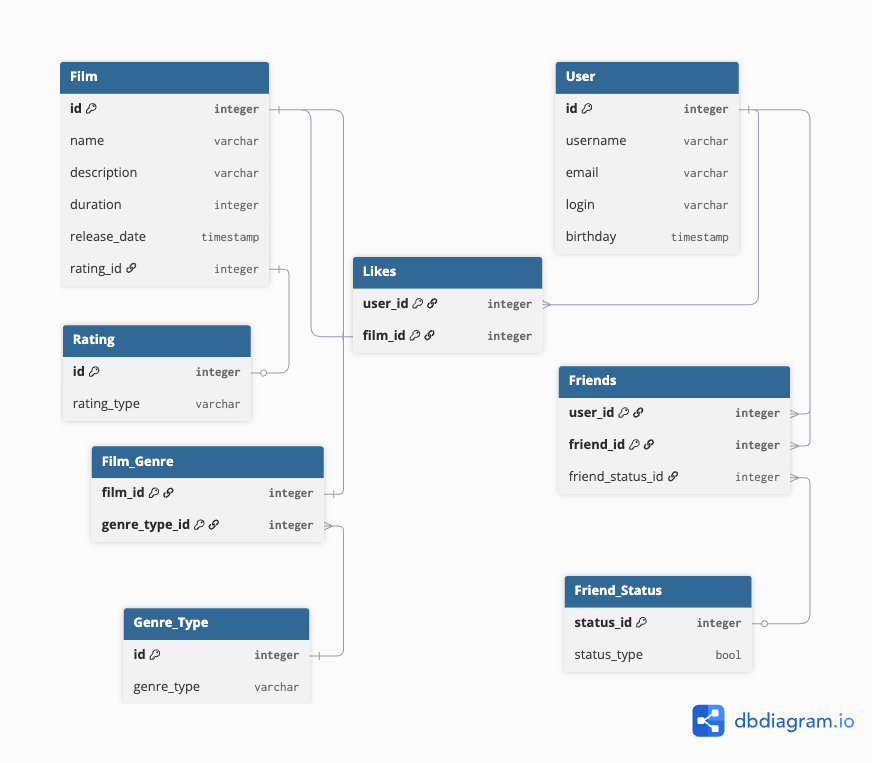

# java-filmorate

Template repository for Filmorate project.



# Film

Таблица, которая хранит информацию о фильмах

# User

Таблица, которая хранит информацию о пользователях

# Rating

Справочник возрастных рейтингов.
PK таблицы является FK в таблице Film

# Genre_Type

Справочник жанров

# Film_Genre

Таблица, которая связывает фильм с его жанрами

# Likes

Таблица в которой хранятся id фильмов и id пользователей лайкнувших эти фильмы

# Friends_Status

Отдельная таблица-справочник для статусов дружбы (подтвержден/неподтвержден)

# Friends

Таблица, которая хранит инфомрацию о друзьях и статусах подтверждения дружбы

# *Запросы*

<font size="4">1. Получить фильмы с рейтингом «PG-13»</font>

```
SELECT f.* FROM Film f
JOIN Rating r ON f.rating_id = r.id
WHERE r.rating_type = 'PG-13';
```

<font size="4">2. Найти фильмы, выпущенные после 2020 года</font>

```
SELECT * 
FROM Film WHERE 
EXTRACT(YEAR FROM release_date) > 2020;
```

<font size="4">3. Количество лайков у каждого фильма (с названием)</font>

```
SELECT f.id, f.name, COUNT(*) AS likes_count
FROM Film f
LEFT JOIN Likes l ON f.id = l.film_id
GROUP BY f.id, f.name
ORDER BY likes_count DESC;
```

<font size="4">4. Топ-10 самых популярных фильмов по количеству лайков</font>

```
SELECT f.id, f.name, COUNT(*) AS likes_count
FROM Film f
LEFT JOIN Likes l ON f.id = l.film_id
GROUP BY f.id, f.name
ORDER BY likes_count DESC
LIMIT 10;
```

<font size="4">5. Количество фильмов по каждому жанру</font>

```
SELECT gt.genre_type, COUNT(fg.film_id) AS film_count
FROM Genre_Type gt
LEFT JOIN Film_Genre fg ON gt.id = fg.genre_type_id
GROUP BY gt.id, gt.genre_type
ORDER BY film_count DESC;
```

<font size="4">6. Получение списка друзей пользователя</font>

```
ELECT u.id,
       u.username,
       u.email,
       u.login,
       u.birthday
FROM User u
JOIN Friends f ON u.id = f.friend_id
JOIN Friend_Status fs ON f.friend_status_id = fs.status_id
WHERE f.user_id = :userId
  AND fs.status_type = TRUE;
```

<font size="4">7. Получение списка неподтвержденных друзей пользователя</font>

```
SELECT u.id,
       u.username,
       u.email,
       u.login,
       u.birthday
FROM User u
JOIN Friends f ON u.id = f.friend_id
JOIN Friend_Status fs ON f.friend_status_id = fs.status_id
WHERE f.user_id = :userId
  AND fs.status_type = FALSE; 
```

<font size="4">8. Проверка общих друзей двух пользователей</font>

```
SELECT u.id,
       u.username,
       u.email,
       u.login,
       u.birthday
FROM User u
JOIN Friends f1 ON u.id = f1.friend_id
JOIN Friends f2 ON u.id = f2.friend_id
JOIN Friend_Status fs1 ON f1.friend_status_id = fs1.status_id
JOIN Friend_Status fs2 ON f2.friend_status_id = fs2.status_id
WHERE f1.user_id = :userId1
  AND f2.user_id = :userId2
  AND fs1.status_type = TRUE
  AND fs2.status_type = TRUE;
```